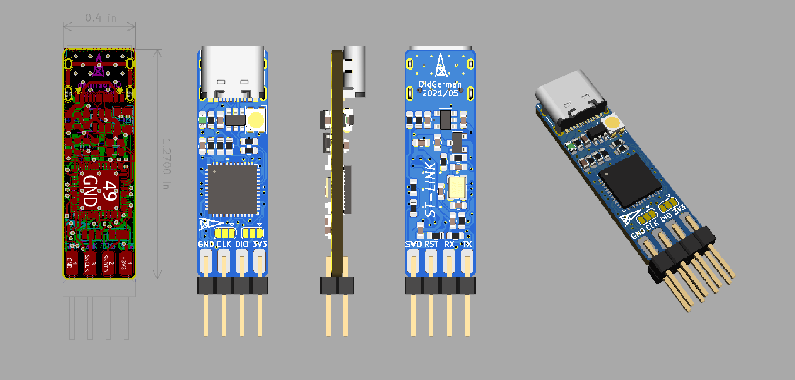
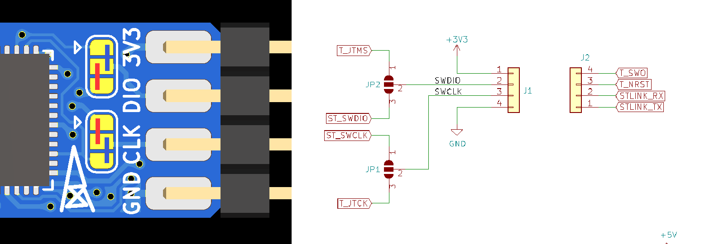

# ST-LINK-ODG

> USB-C口的ST-LINK模块（0603元件100%，易于焊接 ）

ST官方的Nucleo-64板子用ST-LINK有点不方便，前段时间看到稚晖君开源了USB-C口的[ST-Link-Nano](https://github.com/peng-zhihui/ST-Link-Nano)，心血来潮也想做一个，无奈本人手残焊不来0402元件，遂准备做一个0603版本的。以前一直用Eagle，听朋友[稀饭放姜](https://space.bilibili.com/393224264?spm_id_from=333.788.b_765f7570696e666f.1)说Kicad更香，跟着他的[视频教程](https://www.bilibili.com/video/BV12J411z7j7?from=search&seid=1305491858116785113)快速学习了一个，于是整出来了：

## Notice

### PCB工艺参数

- PCB厚度1.6mm，双面板
- 线宽/线距6mil，最小过孔0.3mm，最小阻焊桥>5mil

### 物料

- PCB上有一个3528封装的LED，是红-普绿双色反极的（与ST官方开发板一样），”普绿“就是黄绿色的意思，不要与常见的红-翠绿双色LED混淆（翠绿真心丑还倍儿亮），[推荐购买链接](https://item.taobao.com/item.htm?id=569456631431)，也可以用普通0603 LED代替

- USBLC6-2SC6是USB2.0总线ESD保护器件

- USB D+ 的1.5K上拉电阻经S8050到3.3V，B极由MCU的GPIO控制，与ST的原理图一致没有省

### 跳线

  红色跳线被下载固件，蓝色跳线当ST-LINK

  

## 焊接测试

> S8050左右脚位反了，待修改，目前反过来焊接S8050能正常使用烧录
